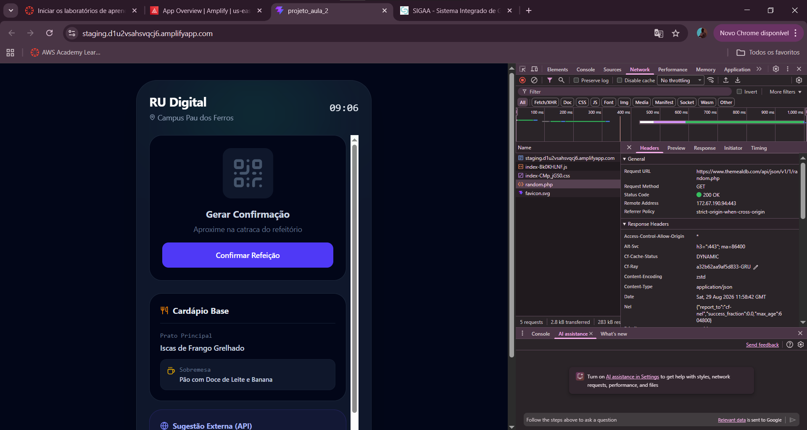
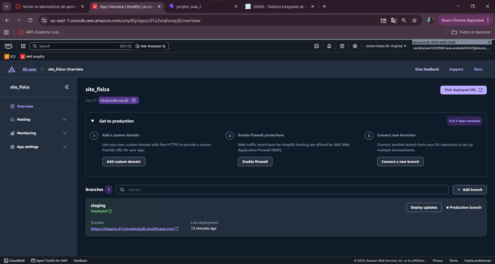
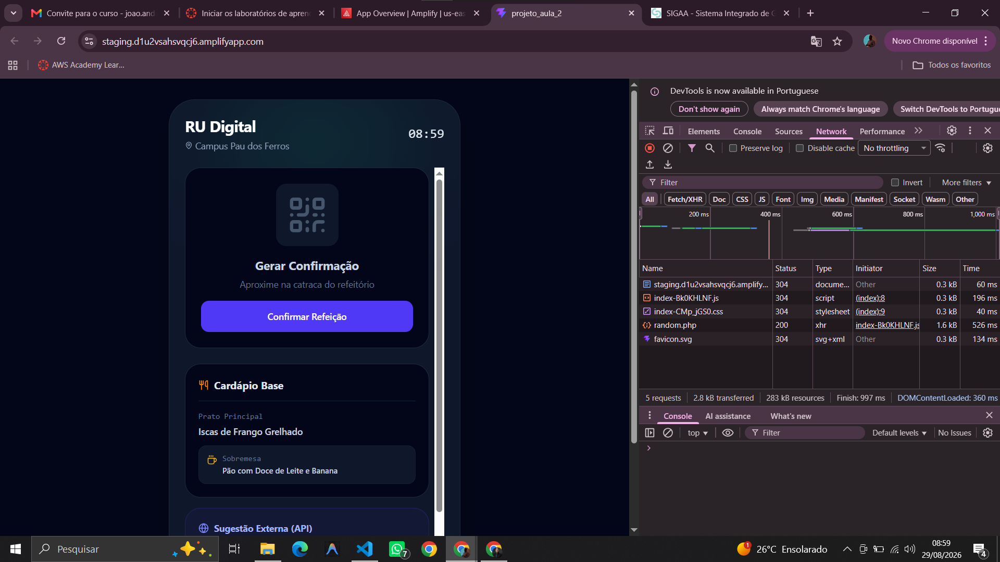

# RU Digital

Uma aplicação web moderna para gerenciamento digital do Restaurante Universitário (RU), permitindo consultas de cardápio, reservas de refeições e controle de acesso.

## Visão Geral

O RU Digital é uma solução completa que moderniza a experiência dos usuários do Restaurante Universitário, oferecendo funcionalidades como:

- 📋 Consulta de cardápio diário
- 🎫 Reserva de refeições online
- 👤 Gerenciamento de perfil de usuário
- 📊 Histórico de refeições
- 🔐 Autenticação segura de usuários
- 📱 Interface responsiva e intuitiva

## Capturas de Tela

Prints do desenvolvimento e da implantação do RU Digital:


*Tela de acesso e cardápio, com a integração à API externa (TheMealDB) usada na sugestão do dia.*


*Publicação da branch `staging` via AWS Amplify Hosting.*


*Testes e depuração da interface durante o desenvolvimento.*

## Stack Tecnológico

- **Frontend**: React 18+ com TypeScript
- **Build Tool**: Vite
- **Styling**: CSS/Tailwind CSS
- **Linting**: ESLint com suporte a TypeScript

## Instalação e Setup

### Pré-requisitos

- Node.js 16+ instalado
- npm ou yarn

### Passos de Instalação

1. Clone o repositório:
```bash
git clone https://github.com/Iucasoa/RU_Digital.git
cd RU_Digital
```

2. Instale as dependências:
```bash
npm install
```

3. Inicie o servidor de desenvolvimento:
```bash
npm run dev
```

4. Acesse a aplicação em `http://localhost:5173`

## Scripts Disponíveis

```bash
# Inicia o servidor de desenvolvimento com HMR
npm run dev

# Build para produção
npm run build

# Preview da build de produção
npm run preview

# Verifica linting
npm run lint
```

## Estrutura do Projeto

```
├── src/
│   ├── components/        # Componentes React reutilizáveis
│   ├── pages/            # Páginas da aplicação
│   ├── services/         # Serviços de API
│   ├── types/            # Definições de tipos TypeScript
│   ├── App.tsx           # Componente principal
│   └── main.tsx          # Ponto de entrada
├── public/               # Arquivos estáticos
├── index.html            # HTML principal
└── package.json          # Dependências do projeto
```

## Funcionalidades Principais

### Autenticação
- Login com credenciais universitárias
- Recuperação de senha
- Gerenciamento de sessão segura

### Cardápio
- Visualização de pratos disponíveis por dia
- Informações nutricionais
- Filtros por tipo de refeição

### Reservas
- Reservar refeições com antecedência
- Cancelamento de reservas
- Confirmação via QR Code

### Perfil
- Edição de dados pessoais
- Histórico de refeições consumidas
- Preferências alimentares

## Configuração ESLint

Para desenvolvimento em produção, ative as verificações de tipo com ESLint:

```js
// eslint.config.js
import tseslint from 'typescript-eslint'

export default defineConfig([
  {
    files: ['**/*.{ts,tsx}'],
    extends: [
      tseslint.configs.recommendedTypeChecked,
      // ou para regras mais rigorosas:
      // tseslint.configs.strictTypeChecked,
    ],
    languageOptions: {
      parserOptions: {
        project: ['./tsconfig.node.json', './tsconfig.app.json'],
        tsconfigRootDir: import.meta.dirname,
      },
    },
  },
])
```

Para regras específicas do React, instale e configure:

```bash
npm install --save-dev eslint-plugin-react-x eslint-plugin-react-dom
```

```js
// eslint.config.js
import reactX from 'eslint-plugin-react-x'
import reactDom from 'eslint-plugin-react-dom'

export default defineConfig([
  {
    files: ['**/*.{ts,tsx}'],
    extends: [
      reactX.configs['recommended-typescript'],
      reactDom.configs.recommended,
    ],
  },
])
```

## Variáveis de Ambiente

Crie um arquivo `.env.local` com as seguintes variáveis:

```env
VITE_API_URL=http://localhost:3000/api
VITE_API_TIMEOUT=5000
```

## Performance

- ✅ HMR (Hot Module Replacement) ativado em desenvolvimento
- ✅ Build otimizado com Vite
- ✅ Code splitting automático
- ✅ Lazy loading de rotas

## Contribuindo

1. Crie uma branch para sua feature (`git checkout -b feature/AmazingFeature`)
2. Commit suas mudanças (`git commit -m 'Add some AmazingFeature'`)
3. Push para a branch (`git push origin feature/AmazingFeature`)
4. Abra um Pull Request

## Licença

Este projeto está sob a licença MIT. Veja o arquivo LICENSE para mais detalhes.

## Contato

Para dúvidas ou sugestões, abra uma issue no repositório.

---

**Desenvolvido com ❤️ para melhorar a experiência do RU**
